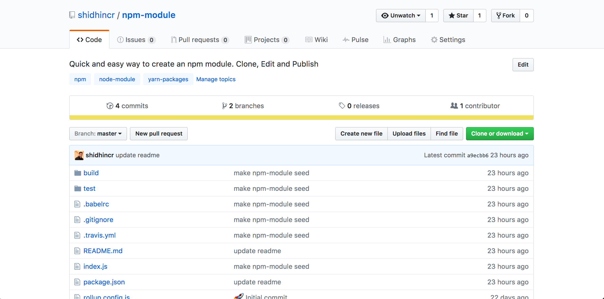

##  Quick and Easy -  NPM Modules

Be smart and make a node module!

---

### WHAT WE NEED, AND, WHY

+++
#### Avoid code repetition
- blah, blah
+++
#### More open source activities
- blah, blah

+++
#### Be creative and smart
- blah, blah

---

### BOOTSTRAPPING IS HARD

+++
### It's 2017
  - Write code in ES6
  - Babel, Babel plugins, Typescript
  - Webpack, Rollup, Gulp, Browserify 
  - **TDD:** AVA, Mocha, Jest

+++ 
### The List Goes on ...
  - .npmrc, .babelrc, .jshintrc, .eslintrc
  - Prettier, JSFormatter ... 

---

### HOW ?

Start with a simple seed/boilerplate template.

+++
### Meet `npm-module`

+++
- Opinionated ( The libraries for build/test/bundle ) are already chosen.
- Zero configuration
- Just 3 npm scripts
- Will be moved to Namshi repo soon.

---
### Let's Start

+++?image=(image for cloning)
+++?image=(image for make changes)
+++?image=(image for test)
+++?image=(image for build)
+++?image=(image for edit package.json)
+++?image=(image for http://www.flaticon.com/)
+++?image=(image for release)

---
### Release and Publish to NPM

---

## THANKS