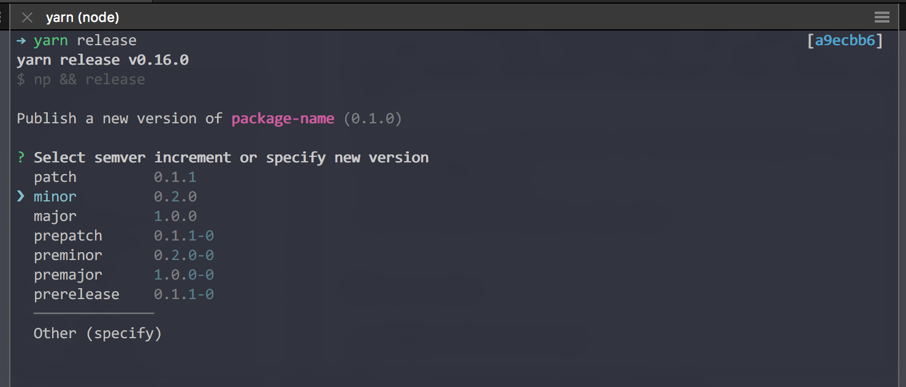

##  Quick and Easy -  NPM Modules

Be smart and make a node module!

---

### WHAT WE NEED, AND, WHY

+++
#### Avoid code repetition
- There're lot of code repeated in our repos
- Break them into small utilities, with unit tests

+++
#### More open source activities
- Good chance to contribute to open source
- NODE community is active
- We get development/bug-fixes for free
- But, should actively maintain the projects

+++
#### Be creative and smart
- Look in our code -- find repeating patterns
- Don't like the other library/module ? Make a better one
- Be creative

---

### BOOTSTRAPPING IS HARD

+++
### It's 2017
  - Write code in ES6
  - Babel, Babel plugins, Typescript
  - Webpack, Rollup, Gulp, Browserify 
  - **TDD:** AVA, Mocha, Jest

+++ 
### The List Goes on ...
  - .npmrc, .babelrc, .jshintrc, .eslintrc
  - Prettier, JSFormatter ... 

---

### SOLUTION ?

Start with a simple seed/boilerplate template.

+++?image=assets/npm-module.png

<h2>Meet npm-module</h2>
[https://github.com/shidhincr/npm-module](https://github.com/shidhincr/npm-module)

+++
- Opinionated ( The libraries for build/test/bundle ) are already chosen.
- Zero configuration
- Just 3 npm scripts
- Will be moved to Namshi repo soon.

---
### Let's Start

+++?image=assets/clone.png
+++
### Install: Just run the command `yarn`

+++?image=assets/edit-changes.png
+++?image=assets/scripts.png
+++?image=assets/test.png
+++
### Build

+++
### Build

+++?image=assets/code-package-json.png
+++
### ICONS

---
### Release and Publish to NPM
Using `np` and `release`

---

## THANKS

### [@shidhincr](https://twitter.com/shidhincr)